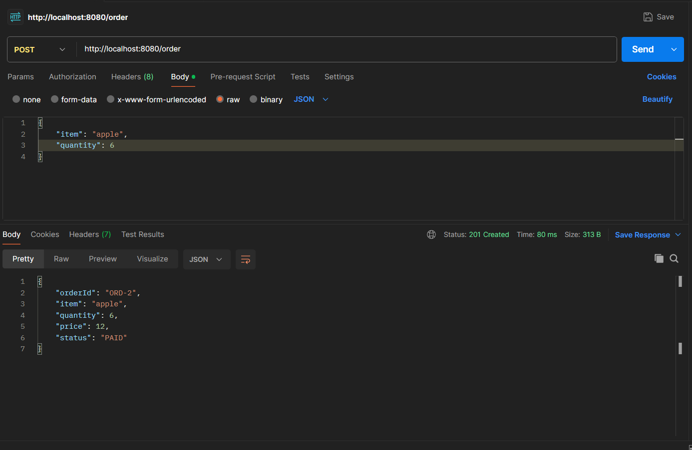
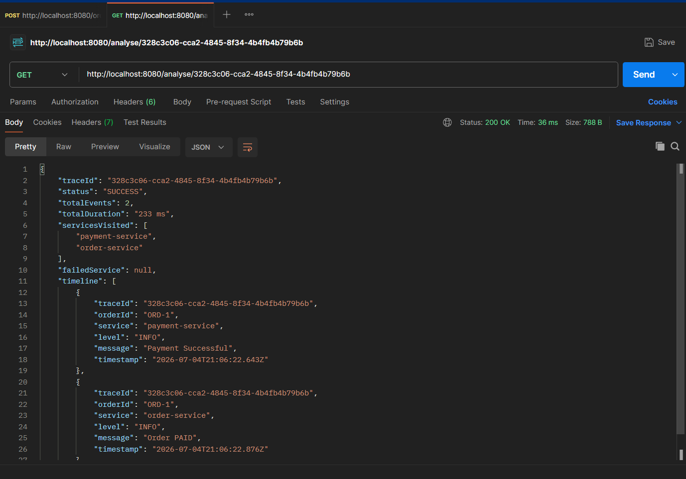
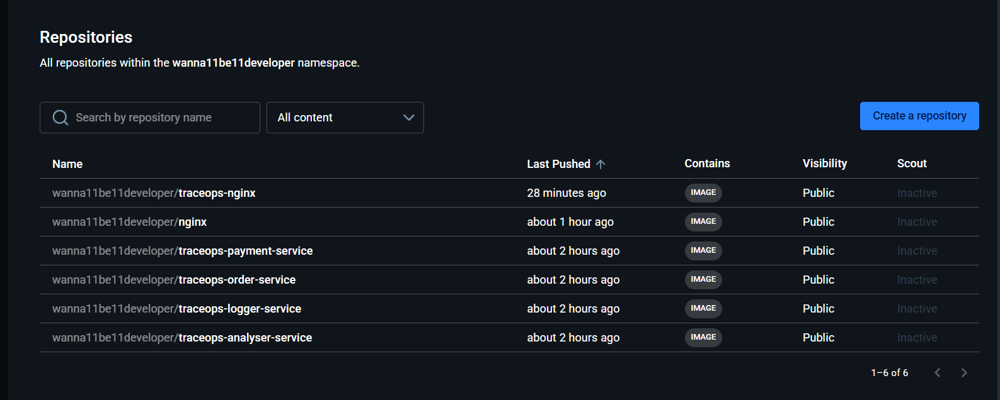
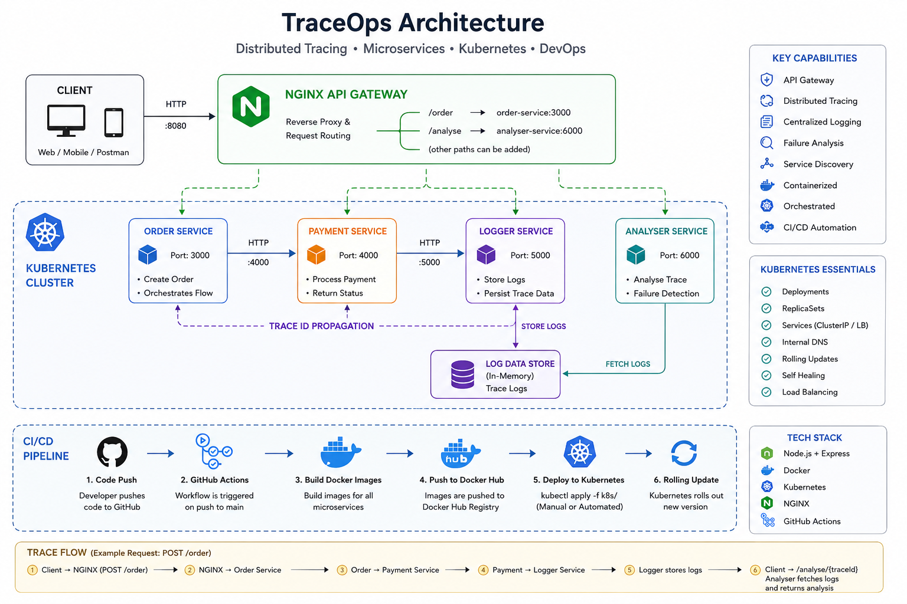

# 🚀 TraceOps - Cloud Native Distributed Tracing Platform

> A production-inspired cloud-native microservices platform demonstrating distributed tracing, centralized logging, Kubernetes orchestration, API Gateway, Docker-based deployments, and CI automation using GitHub Actions.


---

# Overview

TraceOps is a DevOps-focused microservices project built to simulate how modern cloud-native applications are deployed and operated.

Instead of focusing only on backend APIs, the project demonstrates the complete DevOps lifecycle:

- Containerization using Docker
- Multi-container orchestration using Docker Compose
- Kubernetes deployments
- Internal service discovery
- API Gateway using NGINX
- Distributed request tracing
- Centralized logging
- Failure analysis
- CI pipeline using GitHub Actions
- Docker Hub image publishing

---
# Git CI

# Route Check


# Kubernetes Logs

# Docker hub


# Architecture

```


```

---

# DevOps Workflow

```

Developer
│
▼
Git Push
│
▼
GitHub Actions
│
├── Build Docker Images
├── Push Images to Docker Hub
▼
Kubernetes Cluster
│
├── Deployments
├── Services
├── Internal DNS
▼
NGINX Gateway
│
▼
Microservices

```

---

# Tech Stack

## Backend

- Node.js
- Express.js

## Containerization

- Docker
- Docker Compose

## Container Registry

- Docker Hub

## Orchestration

- Kubernetes
- Deployments
- Services
- Internal DNS

## Networking

- NGINX Reverse Proxy
- API Gateway

## CI/CD

- GitHub Actions

---

# DevOps Features

## Dockerized Microservices

Each service runs in its own isolated Docker container.

- Order Service
- Payment Service
- Logger Service
- Analyzer Service
- NGINX Gateway

---

## Docker Compose

Local multi-container development environment.

Features:

- Automatic service networking
- Environment variable management
- Container dependency management
- One-command startup

```bash
docker compose up
```

---

## Kubernetes

Every microservice is deployed independently using Kubernetes Deployments.

Features:

- Replica management
- Self-healing pods
- Rolling updates
- Service discovery
- Load balancing

---

## Kubernetes Services

Each microservice communicates using Kubernetes DNS.

Example:

```

http://payment-service:4000

```

instead of

```

localhost:4000

```

---

## API Gateway

NGINX acts as the single entry point.

Client only communicates with

```

localhost:8080

```

NGINX internally routes requests to the appropriate service.

---

## Distributed Tracing

Every request receives a unique Trace ID.

Example

```

3cde8149-a54e-43c6-a5d8-f8569e63c992

```

The Trace ID propagates automatically across all services.

---

## Centralized Logging

Every service pushes structured logs to Logger Service.

Each log stores

- Trace ID
- Order ID
- Timestamp
- Service Name
- Log Level
- Message

---

## Failure Analysis

Analyzer Service reconstructs the complete lifecycle of any request.

It provides

- Timeline reconstruction
- Service traversal
- Total execution duration
- Failure detection
- Root cause identification

---

## GitHub Actions

Every push to the main branch automatically

- Builds Docker images
- Pushes images to Docker Hub

CI Pipeline

```

Git Push

↓

GitHub Actions

↓

Docker Build

↓

Docker Hub

```

---

# Docker Images

| Image | Purpose |
|---------|----------|
| traceops-order-service | Order Processing |
| traceops-payment-service | Payment Processing |
| traceops-logger-service | Central Logging |
| traceops-analyser-service | Trace Analysis |
| traceops-nginx | API Gateway |

---

# Project Structure

```

traceops/

├── .github/
│ └── workflows/
│ └── ci.yml
│
├── order-service/
├── payment-service/
├── logger-service/
├── analyser-service/
├── nginx/
│
├── docker-compose.yml
│
└── k8s/
├── order-deployment.yaml
├── payment-deployment.yaml
├── logger-deployment.yaml
├── analyser-deployment.yaml
├── nginx-deployment.yaml
└── services/

```

---

# Running Locally

## Docker Compose

```bash
docker compose up --build
```

---

## Kubernetes

Deploy everything

```bash
kubectl apply -f k8s/
```

Check pods

```bash
kubectl get pods
```

Check services

```bash
kubectl get svc
```

Port forward NGINX

```bash
kubectl port-forward service/nginx 8080:80
```

---

# API Endpoints

## Create Order

```http
POST /order
```

Body

```json
{
    "item":"apple",
    "quantity":5
}
```

---

## Analyze Trace

```http
GET /analyse/{traceId}
```

Returns

- Timeline
- Services Visited
- Execution Time
- Failure Status

---

# CI Pipeline

The project uses GitHub Actions to automatically

✅ Checkout Repository

✅ Login to Docker Hub

✅ Build Order Service

✅ Build Payment Service

✅ Build Logger Service

✅ Build Analyzer Service

✅ Build NGINX

✅ Push Images to Docker Hub

---

# Future Improvements

- CD using GitHub Actions
- Helm Charts
- Prometheus Monitoring
- Grafana Dashboards
- OpenTelemetry
- Jaeger Integration
- Horizontal Pod Autoscaler
- Ingress Controller
- ArgoCD / GitOps Deployment
- AWS EKS Deployment

---

# Learning Outcomes

This project demonstrates practical experience with

- Microservices Architecture
- Docker
- Docker Compose
- Kubernetes
- NGINX
- Service Discovery
- API Gateway
- Distributed Tracing
- Structured Logging
- CI Pipelines
- Docker Hub
- Rolling Deployments
- Cloud Native Architecture

---

# Author

**Adarsh S**

Mechanical Engineering • NITK Surathkal

